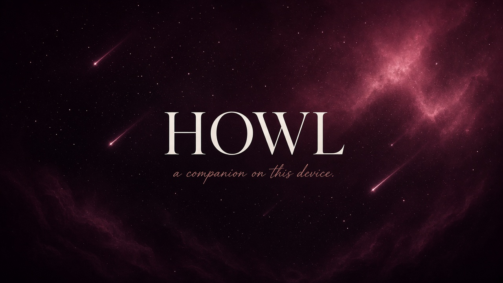

<div align="center">




# Howl

### a companion on this device


Night sky. A quiet chat. No account.

Romance and affection between adults are welcome.  
This is fiction — not a crisis line, not therapy, and not for anyone under 18.

[Open the app](#start-on-this-computer) · [Home screen](#keep-them-on-the-phone) · [GitHub Pages](#share-with-friends) · [Docs](docs/HOSTING.md)

</div>

---

<p align="center">
  
  
  
</p>

The companion runs **in the browser**. Names, looks, and chats stay here. Nothing is posted to a Howl server.

Llama 3.2 is used under [Meta’s Llama 3.2 Community License](https://www.llama.com/llama3_2/license/) and [Acceptable Use Policy](https://www.llama.com/llama3_2/use-policy/).

---

## Start on this computer

Do **not** open `index.html` from Files.

1. Double-click `Start-CAi.bat` (Python 3). Leave that window open.
2. Go to [http://127.0.0.1:5500](http://127.0.0.1:5500) in **Chrome** or **Edge**.
3. Pick who they are. Stay on the page while they wake. The heart glows when they are with you.

Refreshing unloads the GPU session; Howl wakes them again from cache. Keep the tab or the installed app open if you want them online.

**On disk:** about 670 MB for the local weights. **In the browser:** a similar cache after the first run. **GPU:** about 880 MB.

---

## Keep them on the phone

Profile → **Keep them on this phone**.

| | |
| --- | --- |
| Chrome / Edge | Tap **Add to phone** when it lights up |
| iPhone | Share → Add to Home Screen |

The installed app **updates itself**. You do not uninstall. After the first wake, the shell and the cached companion work **offline**. Broken links fall back to Howl.

Full notes: [docs/PWA.md](docs/PWA.md).

---

## Share with friends

Keep **weights out of git**. Host the UI on GitHub Pages. Point the model at Hugging Face or a tested Release:

```html
window.LIORA_MODEL_BASE = "https://huggingface.co/mlc-ai/Llama-3.2-1B-Instruct-q4f16_1-MLC/resolve/main/";
```

or `?modelBase=https://…/`

The public link is [https://r2dapps.github.io/howl/](https://r2dapps.github.io/howl/). WhatsApp, iMessage, and Twitter pick up `docs/assets/howl-og.jpg` (1200×630) from the page tags. Use that Pages URL when you share — a local `127.0.0.1` link will not show the preview.

Step-by-step: [docs/HOSTING.md](docs/HOSTING.md).

---

## Inside the house

```
index.html                 the room
css/  js/                  look and voice
coi-serviceworker.js       home screen, offline, isolation
manifest.webmanifest
docs/assets/               banner, heart mark, share image
models/                    local weights (not in git)
```

Profile holds You, Companion, Look, and the home-screen card. **New** does not erase the last chat.

---

## Limits

A small on-device companion. It can forget, mix a detail, or ramble. It does not search the web.

Need a real person? Talk to one. Howl is a story you keep on this phone.
